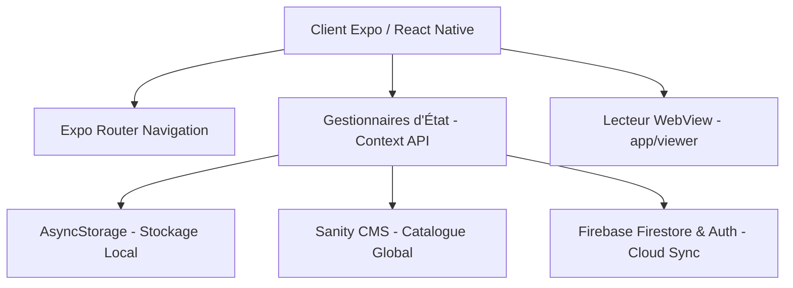

# Documentation Technique - CombiStore

CombiStore est un magasin et lecteur d'applications web (Mini-Apps HTML/JS/Web) développé avec **Expo (React Native)** et **TypeScript**. Il permet aux utilisateurs de parcourir un catalogue centralisé d'applications web, de créer et d'exécuter leurs propres mini-applications personnalisées, et de synchroniser leurs favoris via la nuage.

---

## 🏗️ Architecture Globale



### Stack Technique
* **Frontend Mobile / Web**: Expo v54 (React Native 0.81, React 19)
* **Router & Navigation**: Expo Router v6 (Routing basé sur les fichiers)
* **Animation & UI**: React Native Reanimated v4, Linear Gradient, Expo Haptics
* **CMS & Catalogue**: Sanity Studio (`studio/`), Sanity Client (`@sanity/client`)
* **Authentification & Sync Cloud**: Firebase Authentication (Google Sign-In & Email/Password), Firestore
* **Stockage Local**: `@react-native-async-storage/async-storage`

---

## 📁 Structure du Projet

```text
CombiStore/
├── app/                      # Routes & Écrans Expo Router
│   ├── (tabs)/               # Navigation par onglets principaux
│   │   ├── index.tsx         # Catalogue principal & Recherche
│   │   ├── categories.tsx    # Exploration des catégories
│   │   └── manage.tsx        # Profil & Gestion des apps utilisateur
│   ├── viewer/[id].tsx       # Écran d'exécution/lecture de la Mini-App (WebView)
│   ├── info.tsx              # Fiche détaillée & avis d'une application
│   ├── manage-app.tsx        # Formulaire de création / modification d'une app
│   └── _layout.tsx           # Layout racine avec Providers de contextes
├── src/                      # Code source métier
│   ├── components/           # Composants UI réutilisables & animés
│   ├── constants/            # Thèmes, animations et données par défaut
│   ├── context/              # Contextes React (Apps, Auth, Categories, Favorites, Theme)
│   ├── hooks/                # Hooks personnalisés (Animation, Context access)
│   ├── lib/                  # Client d'intégration Sanity CMS
│   ├── services/             # Services Firebase et mises à jour Expo OTA
│   └── types/                # Types et interfaces TypeScript
└── studio/                   # CMS Sanity Studio embarqué
    └── schemaTypes/          # Schémas Sanity (Category, MiniApp, Developer)
```

---

## 🔐 Configuration des Variables d'Environnement

Créez un fichier `.env` à la racine du projet contenant :

```env
# Configuration Sanity CMS
EXPO_PUBLIC_SANITY_PROJECT_ID=votre_project_id
EXPO_PUBLIC_SANITY_DATASET=production

# Configuration Firebase
EXPO_PUBLIC_FIREBASE_API_KEY=votre_api_key
EXPO_PUBLIC_FIREBASE_AUTH_DOMAIN=votre_project.firebaseapp.com
EXPO_PUBLIC_FIREBASE_PROJECT_ID=votre_project_id
EXPO_PUBLIC_FIREBASE_STORAGE_BUCKET=votre_project.appspot.com
EXPO_PUBLIC_FIREBASE_MESSAGING_SENDER_ID=votre_sender_id
EXPO_PUBLIC_FIREBASE_APP_ID=votre_app_id
EXPO_PUBLIC_FIREBASE_WEB_CLIENT_ID=votre_web_client_id_google_oauth
```

---

## 🚀 Commande de Démarrage et Déploiement

### Développement Mobile & Web
```bash
# Lancer le serveur de développement Expo
npm run start

# Lancer la version Web
npm run web

# Vérification du typage TypeScript
npm run typecheck
```

### CMS Sanity Studio
```bash
# Lancer Sanity Studio localement
cd studio
npx sanity dev
```

---

## 💡 Flux de Données & Fonctionnalités Clés

1. **Chargement des Apps** :
   - Les applications par défaut proviennent soit du CMS Sanity, soit d'un fallback local (`src/constants/defaults.ts`).
   - Les applications ajoutées par l'utilisateur sont sauvegardées dans `AsyncStorage` et synchronisées sur Firestore si l'utilisateur est connecté.
2. **Gestion des Favoris** :
   - Sauvegarde instantanée en local via `AsyncStorage` avec retour haptique.
   - Fusion et synchronisation automatique avec Firestore lors de la connexion.
3. **Exécution des Mini-Apps** :
   - Chargement sécurisé de l'URL de l'application web ou du contenu HTML local dans un composant `WebView` dédié ([`app/viewer/[id].tsx`](file:///d:/Projets/Coding_Projects/CombiStore/app/viewer/[id].tsx)).
